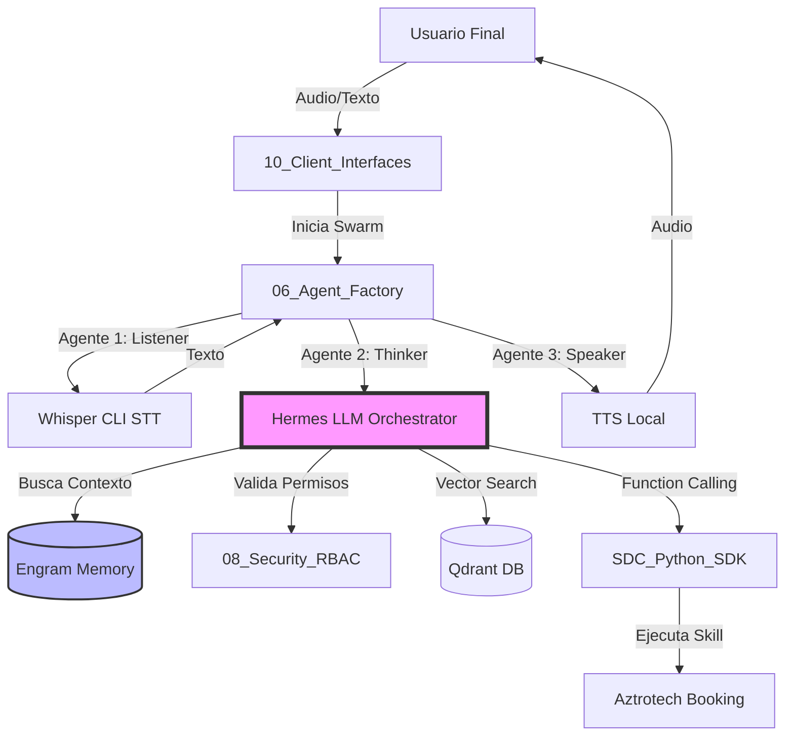

Sonora Digital Corp - Agentic Architecture Map

```mermaid
graph TD
    User[Usuario Final] -->|Audio/Texto| API_Gateway[10_Client_Interfaces]
    API_Gateway -->|Inicia Swarm| Factory[06_Agent_Factory]
    Factory -->|Agente 1: Listener| Whisper[Whisper CLI STT]
    Whisper -->|Texto| Factory
    Factory -->|Agente 2: Thinker| Hermes[Hermes LLM Orchestrator]
    Hermes -->|Busca Contexto| Engram[(Engram Memory)]
    Hermes -->|Valida Permisos| RBAC[08_Security_RBAC]
    Hermes -->|Vector Search| Qdrant[(Qdrant DB)]
    Hermes -->|Function Calling| SDK[SDC_Python_SDK]
    SDK -->|Ejecuta Skill| Aztrotech[Aztrotech Booking]
    Factory -->|Agente 3: Speaker| TTS[TTS Local]
    TTS -->|Audio| User
    style Hermes fill:#f9f,stroke:#333,stroke-width:4px
    style Engram fill:#bbf,stroke:#333,stroke-width:2px
```