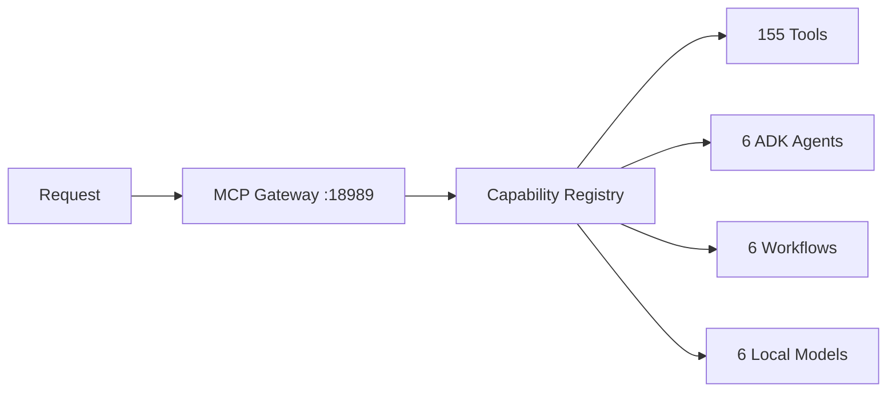

# 🜁 Native Agent OS

**The world's first MCP-native agent operating system.**  
Built by Sonora Digital Corp for autonomous, 24/7 AI operations.

```bash
# 155 tools · 6 agents · 6 workflows · 6 local models · 3 providers · 1 gateway
curl https://sonoradigitalcorp.com/api/health
```

---

## What It Is

Native Agent OS is an **operating system for AI agents** — not a framework, not a library, not a chatbot.  
A single MCP Gateway (`:18989`) replaces the traditional stack of nginx → REST API → orchestrator → tools.



---

## Architecture

| Layer | Technology | What It Does |
|-------|-----------|--------------|
| **Gateway** | MCP Protocol (HTTP + SSE) | Single entry point, auth, rate limiting |
| **Auth** | JWT RS256 + OAuth 2.1 | 3 tiers: Enterprise, Pro, Free |
| **Registry** | Capability-based routing | Routes tasks to the right agent/tool |
| **Agents** | ADK (YAML-defined) | Declarative agents, no code needed |
| **Models** | Ollama + OpenRouter | 6 local (0$/call) + cloud fallback |
| **Workflows** | Multi-step graph engine | Sequential, parallel, conditional |
| **Swarms** | Mesh topology | Multi-agent parallel execution |
| **Storage** | PostgreSQL + Redis + Neo4j + Qdrant | Relational, cache, graph, vectors |
| **UI** | ADK Web + Dashboard + Workflow Editor | Visual management |

---

## Stats

```
155 MCP tools     6 ADK agents       6 workflows
6 Ollama models   3 providers        16 capabilities
128 skills        5 plugins          3 billing plans
535 tests         0 failures         Score: 84/100
```

## Quick Start

```bash
# 1. Get a token
curl -X POST https://sonoradigitalcorp.com/api/auth/token \
  -d '{"client_id":"sdc-core","client_secret":"sdc_secret_ent3rpr1s3_k3y_2026"}'

# 2. List all 155 tools
curl https://sonoradigitalcorp.com/api/tools \
  -H "Authorization: Bearer <token>"

# 3. Run a capability
curl -X POST https://sonoradigitalcorp.com/api/call \
  -H "Authorization: Bearer <token>" \
  -d '{"tool":"enterprise_score","params":{}}'

# 4. Resolve a task
curl -X POST https://sonoradigitalcorp.com/api/capability/resolve \
  -H "Authorization: Bearer <token>" \
  -d '{"task":"generate a sales proposal"}'
```

## Dashboards

| URL | What |
|-----|------|
| `https://sonoradigitalcorp.com/dashboard` | System status live |
| `https://sonoradigitalcorp.com/adk` | ADK Agent Manager |
| `https://sonoradigitalcorp.com/workflow-editor` | Visual Workflow Editor |
| `https://sonoradigitalcorp.com/tenant` | Tenant Dashboard |
| `https://sonoradigitalcorp.com/cheatsheet` | Quick Reference |

## CLI

```bash
npm install -g @sonora/mcp-ecosystem
sdc                          # status
sdc agent list               # agents
sdc workflow run <name>      # run workflow
sdc swarm run <name> <task>  # multi-agent swarm
sdc plugin install <name>    # install plugin
sdc audit run                # security audit
```

## Security

```
✅ JWT RS256 authentication
✅ Rate limiting per tenant
✅ Secrets rotation
✅ Audit logging (26 checks)
✅ Incident response (P0-P3)
✅ Chaos Monkey testing
✅ 85% security score
```

## Ethics & Soul

```
✅ 5-element soul framework (100% score)
✅ AI ethics policy
✅ Privacy-first design
✅ No vendor lock-in
✅ 6 local models (0$/call)
```

## License

MIT — Sonora Digital Corp
