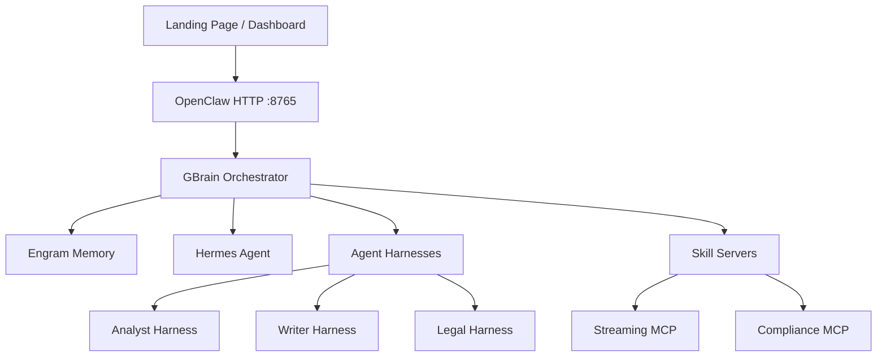

# SIGNAL — Arquitectura

## Visión General

SIGNAL (Music Intelligence Platform) es la plataforma de inteligencia artificial para
**Abe Music Group**, un sello discográfico independiente. Automatiza el descubrimiento
de artistas, la ejecución de workflows de signing, y la gestión de war rooms de negociación.



## Stack Tecnológico

| Capa | Tecnología |
|------|-----------|
| **Frontend** | Next.js 15 (App Router), Tailwind CSS v3, SWR, Recharts |
| **Backend** | NestJS, Drizzle ORM, PostgreSQL 17 + pgvector |
| **Workers** | BullMQ (4 workers: AI, Discovery, Metrics, Alerts) |
| **Infraestructura** | Docker Compose (15 servicios), Prometheus, Grafana |
| **CI/CD** | GitHub Actions (lint → test → build → DockerHub → VPS SSH) |
| **Deploy** | Vercel (frontend) + VPS Docker (backend) |

## 15 Servicios Docker

```
postgres (pgvector:pg17)    → DB principal + vectores
redis (7-alpine)            → Colas + caché
api-gateway (:4000)         → NestJS API Gateway
web (:3000)                 → Next.js frontend
worker-discovery            → Descubrimiento de artistas (Spotify, TikTok, etc.)
worker-metrics              → Métricas de artistas
worker-ai                   → Procesamiento AI (embeddings, scoring)
worker-alerts               → Alertas y notificaciones
notification-service        → Emails (Resend), SMS (Twilio), push
label-copilot (:4002)       → Multi-agente de A&R
workflow-engine (:4003)     → Workflows autónomos
integration (:4001)         → Orquestador de pipeline
prometheus (:9090)          → Métricas
grafana (:3001)             → Dashboards
nginx (:80/:443)            → Reverse proxy + SSL
```

## Frontend — 16 Rutas

| Ruta | Descripción |
|------|-------------|
| `/` | Landing / redirect |
| `/dashboard` | Mission Control |
| `/command-center` | Command Center |
| `/artists` / `/artists/[id]` | Artist Radar |
| `/discovery` | Discovery Engine |
| `/war-rooms` / `/war-rooms/[id]` | War Rooms |
| `/workflows` / `/workflows/[id]` | Workflows |
| `/agents` | Agent Performance |
| `/analytics` | Analytics |
| `/market` | Market Intelligence |
| `/reports` | Executive Reports |
| `/signings` | Signing Pipeline |
| `/playlists` | Playlist Monitor |
| `/finance` | Financial View |
| `/alerts` | Intelligence Alerts |
| `/contracts` | Contracts |
| `/settings` | Settings |

## Pipeline de Datos

```
Discovery Workers → PostgreSQL → AI Service → Label Copilot → Workflow Engine
       ↓                 ↓            ↓              ↓               ↓
  Spotify, TikTok   Vectors +   Scoring +     Multi-agente    Workflows
  YouTube, etc.     Knowledge   Forecasts     Consensus       Autónomos
```

## Próximos Pasos

1. ✅ Frontend en Vercel (31 rutas, 0 errores)
2. ⏳ GitHub org `Abe-Music-Group`
3. ⏳ VPS con Docker (15 servicios)
4. ⏳ SSL con Let's Encrypt
5. ⏳ Conexión frontend → backend real
