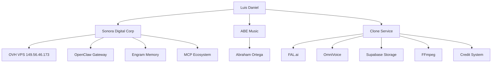

# Relaciones del Cerebro Digital


```mermaid
graph TD
    LD[Luis Daniel] --> SDC[Sonora Digital Corp]
    LD --> ABE[ABE Music]
    LD --> CLONE[Clone Service]
    SDC --> VPS[OVH VPS 149.56.46.173]
    SDC --> OPENCLAW[OpenClaw Gateway]
    SDC --> ENGRAM[Engram Memory]
    SDC --> MCP[MCP Ecosystem]
    ABE --> AO[Abraham Ortega]
    CLONE --> FAL[FAL.ai]
    CLONE --> OMNI[OmniVoice]
    CLONE --> SUPABASE[Supabase Storage]
    CLONE --> FFMPEG[FFmpeg]
    CLONE --> CREDITS[Credit System]
```

## Conexiones desde Engram

```dataview
TABLE type, project, topic_key
FROM "Observations"
WHERE topic_key != null
SORT topic_key ASC
```
